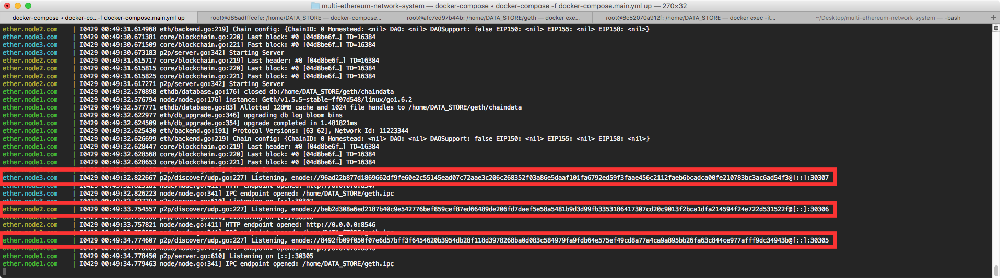
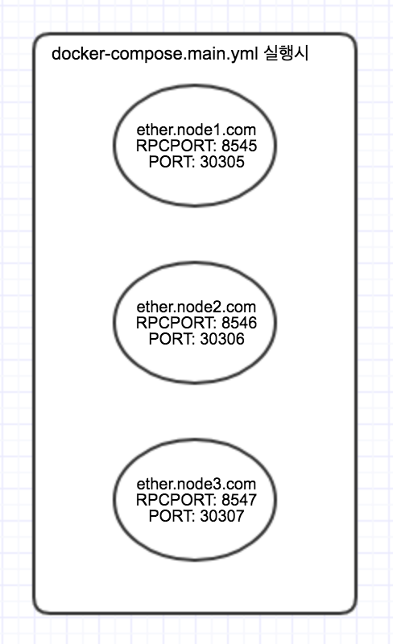
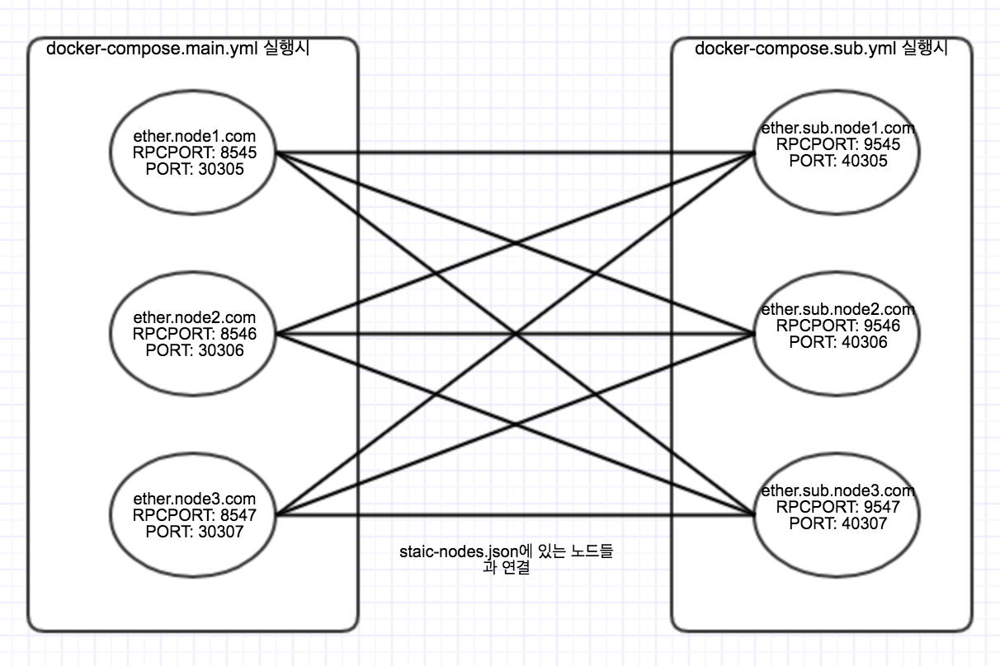
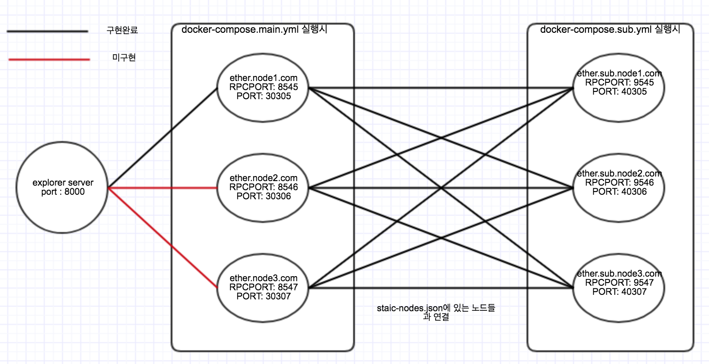
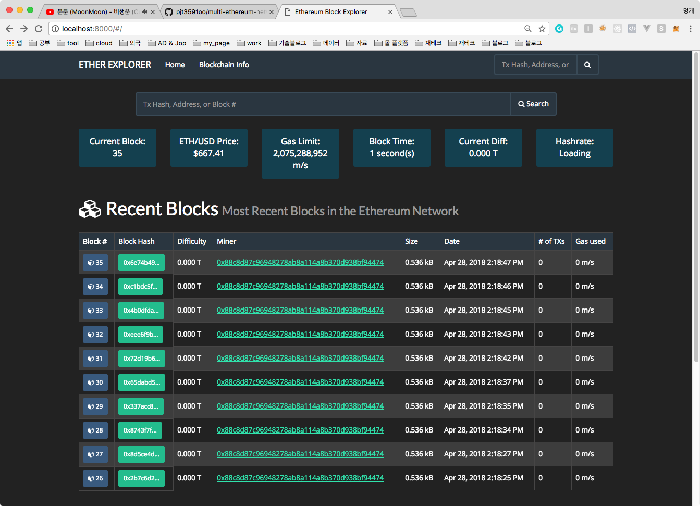

# 이더리움 네트워크 구축

이더리움 네트워크를 빠르게 구축하는 프로젝트

[geth 사용법 바로가기](https://github.com/pjt3591oo/multi-ethereum-network-system/blob/master/docs/usage_geth.md)


0. 내려받기

```
$ git clone https://github.com/pjt3591oo/multi-ethereum-network-system
$ cd multi-ethereum-network-system
$ git submodule init
$ git clone --recursive https://github.com/ethereum/go-ethereum
```

1. 이미지 파일 생성

```sh
$ docker build -t ethereum .
```

2. 메인 노드 컨테이너 생성

main 노드와 sub 노드 생성

2.1. 메인 노드 컨테이너 생성

```sh
$ docker-compose -f docker-compose.main.yml up -d
```



만약 -d 옵션을 주지 않았다면 백그라운드로 실행하지 않으므로 해당 이미지 처럼 생성된 노드들의 admin.nodeInfo.enode 정보를 바로 볼 수 있음.



* 컨테이너 확인

```
$ docker ps
CONTAINER ID        IMAGE               COMMAND                  CREATED             STATUS              PORTS                                              NAMES
d2de7c164fe4        ethereum            "geth --networkid 46…"   45 minutes ago      Up 45 minutes       0.0.0.0:8547->8547/tcp, 0.0.0.0:30307->30307/tcp   ether.node3.com
7044555e3748        ethereum            "geth --networkid 46…"   45 minutes ago      Up 45 minutes       0.0.0.0:8545->8545/tcp, 0.0.0.0:30305->30305/tcp   ether.node1.com
ef8f315e10a9        ethereum            "geth --networkid 46…"   45 minutes ago      Up 45 minutes       0.0.0.0:8546->8546/tcp, 0.0.0.0:30306->30306/tcp   ether.node2.com
```

* 컨테이너 접속

 ```
$ docker exec -it ether.node1.com /bin/bash
$ docker exec -it ether.node2.com /bin/bash
$ docker exec -it ether.node3.com /bin/bash
 ```

* geth attach

```
$ geth attach http://localhost:${RPCPORT} console
```

> attach란? 실행중인 프로그램에 접속하는 행위

2.1. 서브 노드 컨테이너 생성

서브 노드들을 생성하기 전에 생성한 main 노드들을 attach한 후 노드들의 **`admin.nodeInfo.enode`** 를 **`static-nodes.json`** 으로 만들어 준다.

```json
[
    "enode://8492fb09f050f07e6d57bff3f6454620b3954db28f118d3978268ba0d083c584979fa9fdb64e575ef49cd8a77a4ca9a895bb26fa63c844ce977afff9dc34943b@192.168.1.25:30305",
    "enode://beb2d308a6ed2187b40c9e542776bef859cef87ed66489de206fd7daef5e58a5481b9d3d99fb3353186417307cd20c9013f2bca1dfa214594f24e722d531522f@192.168.1.25:30306",
    "enode://96ad22b877d1869662df9fe60e2c55145ead07c72aae3c206c268352f03a86e5daaf101fa6792ed59f3faae456c2112faeb6bcadca00fe210783bc3ac6ad54f3@192.168.1.25:30307"
]
```

ip 주소는 실행환경에 맞춰서 바꿔준다.

```sh
$ docker-compose -f docker-compose.sub.yml up -d
```

* 컨테이너 확인

```
$ docker ps
CONTAINER ID        IMAGE               COMMAND                  CREATED             STATUS              PORTS                                              NAMES
c83040fe67a8        ethereum            "geth --networkid ..."   About an hour ago   Up About an hour    0.0.0.0:9546->9546/tcp, 0.0.0.0:40306->40306/tcp   ether.sub.node2.com
6c52070a912f        ethereum            "geth --networkid ..."   About an hour ago   Up About an hour    0.0.0.0:9545->9545/tcp, 0.0.0.0:40305->40305/tcp   ether.sub.node1.com
9744cd8a20ce        ethereum            "geth --networkid ..."   About an hour ago   Up About an hour    0.0.0.0:9547->9547/tcp, 0.0.0.0:40307->40307/tcp   ether.sub.node3.com
```



* 컨테이너 접속

 ```
$ docker exec -it ether.sub.node1.com /bin/bash
$ docker exec -it ether.sub.node2.com /bin/bash
$ docker exec -it ether.sub.node3.com /bin/bash
 ```

* geth attach

```
$ geth attach http://localhost:${RPCPORT} console
```

3. 컨테이너 삭제

```sh
$ ./etherMainNodeDown.sh
$ ./etherSubNodeDown.sh
```

4. explorer

```bash
$ cd explorer
```

```javascript
// ./explorer/app/app.js
var GETH_RPCPORT  	= 8545; 		// for geth --rpcport GETH_RPCPORT
```

연결할 이더 노드 설정

```bash
# ./explorer
$ npm start
```



localhost:8000 접속



아직까진 수동으로 이더 계정 생성후 마이너 동작시켜야 함

5. peer 연결

```
> admin.addPeer("enode://871fab80ea0fa1e8c72afafb69c17ed5ba33e72dff0702fcf6f74cf1d129568dca5af4c05ac8e95f66043372152e25e631d8360a11a43429c17e1a7b7b3f10fa@192.168.1.25:30305")
```
